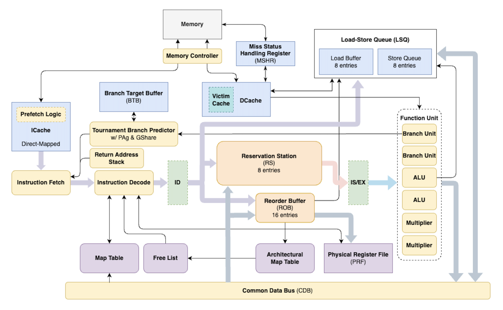

# RISC-V Out-of-Order Processor
An Out-of-Order RISC-V CPU core with several features such as reorder buffer, reservation stations, load/store queue, tournament branch predictor, and non-blocking caches — designed in SystemVerilog for performance and correctness.

## Introduction

This project presents the design and implementation of a 32-bit out-of-order processor based on a 2-way R10K-style microarchitecture, developed as part of the EECS 470: Computer Architecture course at the University of Michigan. The processor supports the RV32IM ISA and integrates advanced features to optimize efficiency and performance.

Key enhancements include a tournament branch predictor that dynamically combines local and global strategies, a non-blocking data cache (DCache), and instruction prefetching. Core architectural structures such as the Reorder Buffer (ROB), Reservation Stations (RS), Load-Store Queue (LSQ), and Miss Status Handling Register (MSHR) enable precise and efficient out-of-order execution.

The design was validated through extensive unit tests, integration tests, and performance evaluation. The final implementation achieved a **CPI of 2.26** with a clock period of 10 ns, demonstrating the effectiveness of the architectural optimizations.

## Design Overview
### Basic Features
- A base out-of-order processor.
- Multiple functional units with varying latencies. 
- Instruction and Data cache.
- Branch prediction and address prediction.

### Advanced Features
- 2-way superscalar execution.
- Tournament branch predictor.
- Branch target buffer (BTB) with Least-recently used (LRU) policy.
- Return address stack (RAS) for function calls.
- Instruction prefetching in the instruction cache (ICache).
- Non-blocking data cache (DCache) with Miss status handling registers (MSHRs).
- Victim cache with LRU policy.
- Out-of-order memory access using a Load-Store Queue (LSQ).
- Data forwarding from loads to stores in the LSQ.

### Supproting Structures
At the core of the design is the **main pipeline**, which consists of five stages:  
**Fetch/Dispatch → Issue → Execute → Complete → Retire**, separated by pipeline registers.

To enable precise out-of-order execution, the design incorporates R10K-inspired structures:  
- **Reorder Buffer (ROB)** – manages instruction retirement in program order.  
- **Map Table & Architectural Map Table** – handle register renaming and dependency tracking.  
- **Free List & Physical Register File** – allocate and store physical registers for renamed operands.

The **memory subsystem** further supports execution with:  
- **Instruction Cache (ICache)** – delivers instructions efficiently to the pipeline.
- **Data Cache (DCache)** – supports non-blocking access with Miss Status Handling Registers (MSHRs).  
- **Store Queue & Load Buffer** – handle memory disambiguation and forwarding.
- **Memory Controller** – manages external memory transactions.

Lastly, control hazards are mitigated by a **tournament branch predictor**, which dynamically combines local and global history. Alongside a **Branch Target Buffer (BTB, LRU policy)** and a **Return Address Stack (RAS)**, this predictor significantly reduces pipeline stalls caused by branch mispredictions.  

  
   
  <em>Figure 1: Top-level Overview of our R10K based Processor.</em>

## Testing & Verification

Our testing process followed a structured methodology to ensure correctness, reliability, and performance of the processor.

### Testing Strategy
- **Unit Testing:**  
  Each module was tested individually with simple test cases, both before and after synthesis, to verify correctness and avoid overly complex logic.   

- **Integration Testing:**  
  Modules were incrementally combined (e.g., pipeline + memory) to simplify debugging and prepare for full system integration.  

- **Test Programs:**  
  1. **Simple Instruction Tests (`btest1.s`)** – Verified fetch, decode, and execute correctness without memory operations.  
  2. **Basic Memory Tests (`mult.s`)** – Included minimal load/store instructions to validate DCache and LSQ.  
  3. **Complex Programs (`alexnet.c`)** – Stress-tested pipeline + memory for end-to-end functionality.  
  4. **Custom LSQ Forwarding Test** – Designed to thoroughly evaluate load-store queue forwarding using recursive calculations, dependent load/store sequences, matrix multiplications, and branching.  
     - **Without forwarding:** Loads stall until stores commit → delays.  
     - **With forwarding:** LSQ directly forwards values → correct results without delay.  

- **Automated Regression:**  
  A shell script was used to run all test cases systematically and verify correctness.

### Automation & Analysis Scripts
To improve efficiency, several shell scripts were developed:
- **Simulation & Synthesis Automation:** Runs tests and compares write-back/output files against ground truth.  
- **CPI Calculation Script:** Automatically computes average CPI across all test cases for performance evaluation.  
- **Configuration Analysis:** Collected and compared results across different design configurations to guide architectural improvements.

These tools enabled quick debugging, streamlined analysis, and guided optimization decisions during the design process.

## Evaluation & Analysis
### Store-to-Load Forwarding

Enabling store-to-load forwarding in the LSQ reduced overall CPI by **4.93%** across benchmarks.  
- Performance gains were most significant in workloads with a high fraction of load instructions.  
- In C programs, about 7% of load instructions benefited directly from forwarding.  

These results confirm that store-to-load forwarding improves performance, with benefits proportional to the workload’s memory access intensity.

    <figure style="display:inline-block; text-align:center; margin: 10px;">
        
    <figcaption><em>Figure 2: Store-to-Load Forwarding</em></figcaption>
    </figure>

    <figure style="display:inline-block; text-align:center; margin: 10px;">
        
    <figcaption><em>Figure 3: Load Forwarding Percentage</em></figcaption>
    </figure>

### Tournament Branch Predictor

Comparing the final pipeline against a version without branch prediction.  
- Including a branch predictor reduced CPI significantly, achieving **~80%** accuracy across all test cases.  
- Initialization of the two-bit counter to *weakly not taken* improved performance for smaller assembly programs, though differences were minimal for C programs.  
- Varying tournament selector size showed diminishing returns beyond a moderate size.  
- The tournament predictor adaptively chose between local and global predictors, providing the best performance overall.  

The tournament branch predictor improved pipeline efficiency and maintained high accuracy across diverse workloads.

    <figure style="display:inline-block; text-align:center; margin: 10px;">
        
    <figcaption><em>Figure 4: Branch Predictors</em></figcaption>
    </figure>

    <figure style="display:inline-block; text-align:center; margin: 10px;">
        
    <figcaption><em>Figure 5: Prediction Accurancy</em></figcaption>
    </figure>

### Non-Blocking Cache
Non-blocking cache allows it to continue servicing requests while waiting for memory during a miss.

This design is particularly effective for workloads with large, continuous loads (e.g., outer product), and reduced CPI by **27%** compared to a blocking design.

    <figure style="display:inline-block; text-align:center; margin: 10px;">
        
    <figcaption><em>Figure 6: Non-blocking Cache</em></figcaption>
    </figure>

### Data Cache & Victim Cache Hit

The baseline data cache achieved an **86.1% hit rate** in C programs.  
By adding a victim cache, the effective hit rate increased by an additional **3.14%**, resulting in a combined hit rate of ~**90%** and a miss rate of ~10%.  
This improvement reduced memory stalls and enhanced overall processor performance.

    <figure style="display:inline-block; text-align:center; margin: 10px;">
        
    <figcaption><em>Figure 7: Data Cache Hit Rate</em></figcaption>
    </figure>

## Execution

This project is built and run using a Makefile-based flow.  
> ⚠️ Note: Running the design requires licensed EDA tools (e.g., Synopsys VCS, Verdi).  

### Simulation
- `make simv` – compile the CPU and testbench  
- `make <program>.out` – run a program (e.g., `make mult.out`)  
- `make simulate_all` – run all programs in the `programs/` folder  

### Synthesis
- `make syn_simv` – compile synthesized CPU  
- `make <program>.syn.out` – run a program on the synthesized design  

### Debugging & Coverage
- `make <module>.verdi` – open a module or CPU run in Verdi GUI  
- `make <module>.cov` – generate a coverage report  
